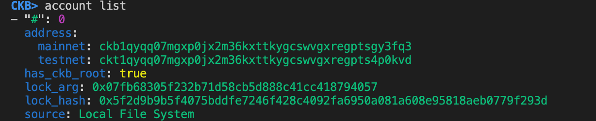
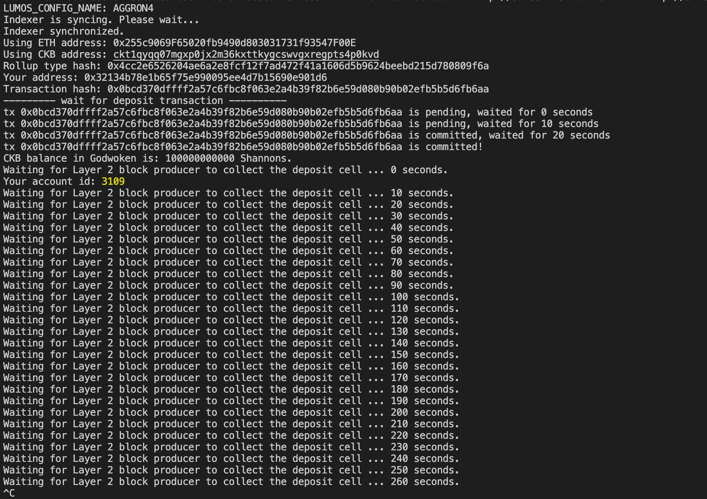
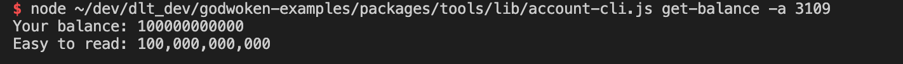

# A screenshot of the accounts you created (account list) in ckb-cli.

# A link to the Layer 1 address you funded on the Testnet Explorer.
https://explorer.nervos.org/aggron/address/ckt1qyqq07mgxp0jx2m36kxttkygcswvgxregpts4p0kvd

# A screenshot of the console output immediately after you have successfully submitted a deposit to Layer 2.

And proof it went through

