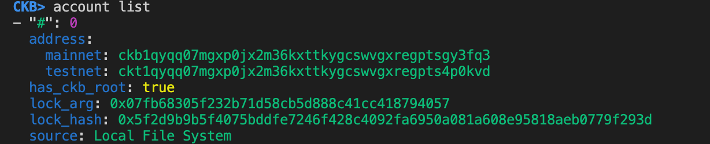
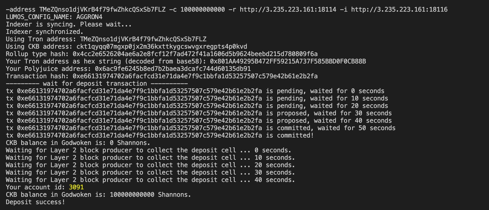
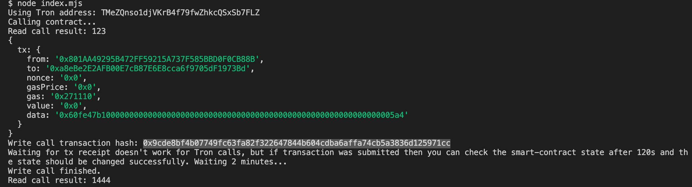

# A screenshot of the accounts you created (account list) in ckb-cli.


# A link to the Layer 1 address you funded on the Testnet Explorer.
https://explorer.nervos.org/aggron/address/ckt1qyqq07mgxp0jx2m36kxttkygcswvgxregpts4p0kvd 

# A screenshot of the console output immediately after you have successfully submitted a CKByte deposit to your Tron account on Layer 2.


# A screenshot of the console output immediately after you have successfully issued a smart contract calls on Layer 2.


# The transaction hash of the "Contract call" from the console output (in text format).
`0x9cde8bf4b07749fc63fa82f322647844b604cdba6affa74cb5a3836d125971cc`

# The contract address that you called (in text format).
`0xa8eBe2E2AFB00E7cB87E6E8cca6f9705dF1973Bd`

# The ABI for contract you made a call on (in text format).
```
    {
      "inputs": [],
      "stateMutability": "payable",
      "type": "constructor"
    },
    {
      "inputs": [
        {
          "internalType": "uint256",
          "name": "x",
          "type": "uint256"
        }
      ],
      "name": "set",
      "outputs": [],
      "stateMutability": "payable",
      "type": "function"
    },
    {
      "inputs": [],
      "name": "get",
      "outputs": [
        {
          "internalType": "uint256",
          "name": "",
          "type": "uint256"
        }
      ],
      "stateMutability": "view",
      "type": "function"
    }
  ]
```

# Your Tron address (in text format).
`TMeZQnso1djVKrB4f79fwZhkcQSxSb7FLZ`
