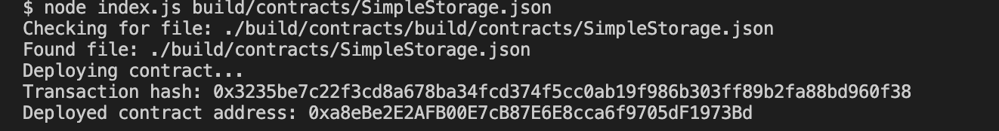

# A screenshot of the console output immediately after you have successfully deployed a smart contract.

# The transaction hash from the contract deployment (in text format).
`0x3235be7c22f3cd8a678ba34fcd374f5cc0ab19f986b303ff89b2fa88bd960f38`

# The deployed contract address from the contract deployment (in text format).
`0xa8eBe2E2AFB00E7cB87E6E8cca6f9705dF1973Bd`
